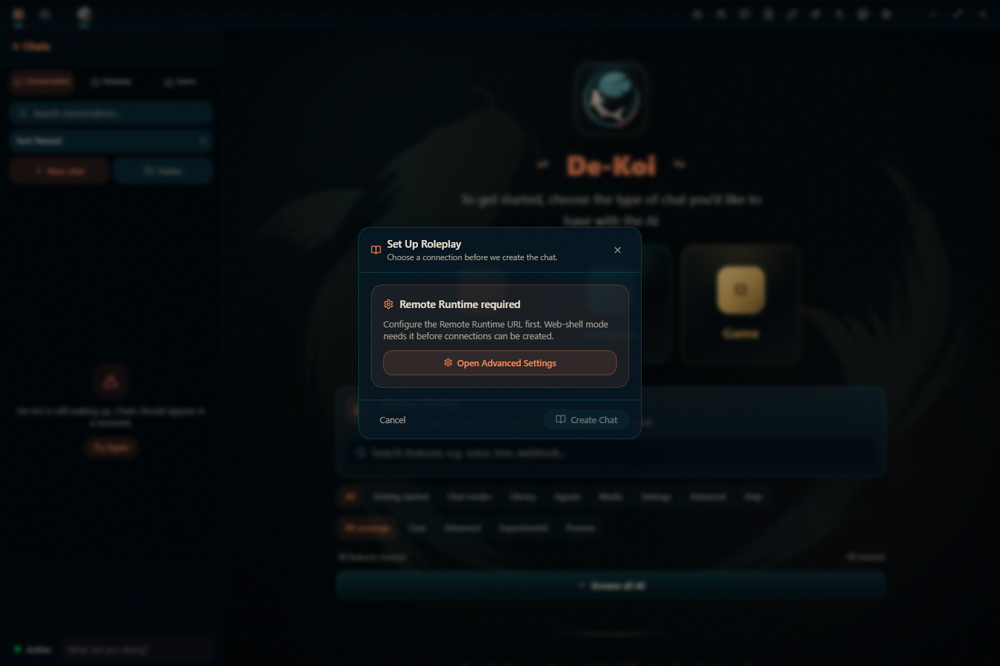
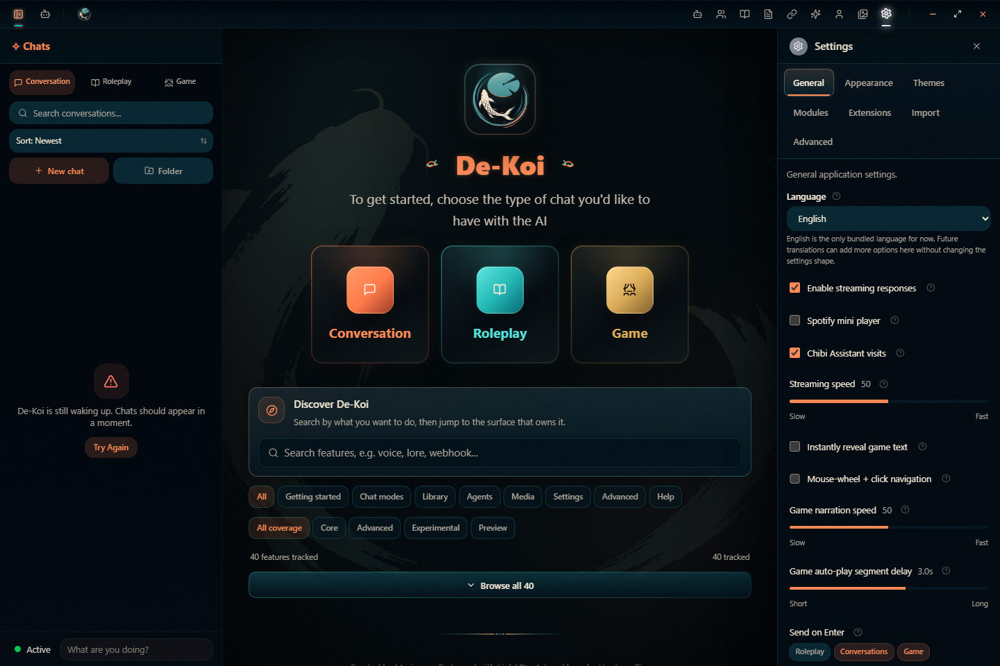
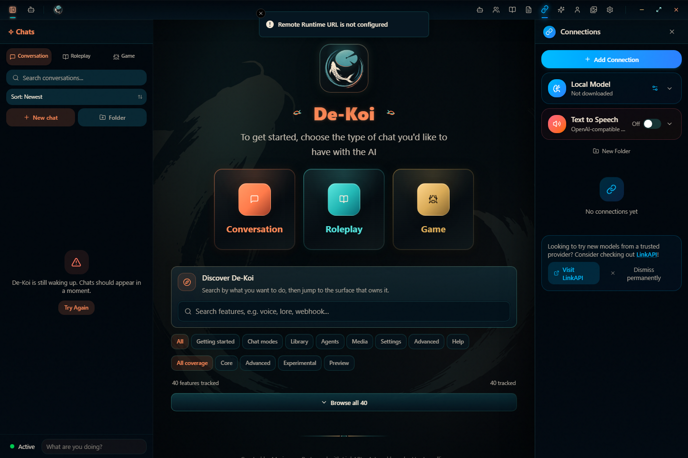

# De-Koi

> [!IMPORTANT]
> De-Koi is an unofficial modified fork of
> [Marinara Engine](https://github.com/Pasta-Devs/Marinara-Engine).
> It is a separate project and is not an official Marinara Engine release,
> support channel, or distribution.
>
> De-Koi is not sponsored by, endorsed by, or released on behalf of Marinara
> Engine, Spicy Marinara, Pasta Devs, or the Marinara Engine project.
>
> De-Koi is licensed under the GNU Affero General Public License version 3.
> See [`LICENSE.txt`](./LICENSE.txt) for the full license and
> [`NOTICE.md`](./NOTICE.md) for fork, attribution, source, and other notices.
>
> If you receive or use a De-Koi binary, installer, Docker image, APK,
> pre-release build, or hosted network service, you should also have access to
> the exact corresponding source code for that version.

De-Koi is a local-first AI chat, roleplay, and game engine built as a Tauri desktop app. It combines a React interface, a TypeScript product engine, and Rust capability modules for local storage, managed assets, provider transport, integrations, and an optional hostable runtime.

This repository is the active De-Koi development line. The app is usable from source, and public release packaging is being rebuilt around the Tauri desktop plus optional Rust runtime architecture.
Use the `main` branch copy of this documentation for current development and integration work. Historical branch docs may describe legacy architecture and should not be treated as authoritative unless a maintainer explicitly asks for that branch context.
The current build keeps an explicit in-app update check in Settings > Advanced. It opens the matching release page for manual install; signed Tauri auto-install artifacts are not configured yet. See [Release Update Strategy](docs/release-update-strategy.md) for end-user install/update guidance and the stable manual update policy.
Token budget displays and prompt budget paths currently use deterministic estimates rather than provider-exact tokenizers. See [Token Budget Estimates](docs/token-budget-estimates.md) for the tokenizer support spike note and future requirements.
Storage is file-backed JSON collections plus managed asset files. See [De-Koi Storage Schema](docs/database-schema.md) for the current collection catalog and [Legacy Marinara Storage Schema](docs/legacy-database-schema.md) for the generated comparison source.

## Trying De-Koi For The First Time

If you just want to try De-Koi, start with the smallest path that matches your
setup:

- **Use a published desktop release when one is available.** Download it from
  the matching GitHub Release page, read that release's notes, and keep access
  to the corresponding source code. Pre-alpha builds may be unsigned or
  debug-signed, so test them with throwaway data first. See
  [Install Or Update A Release](#install-or-update-a-release).
- **Run from source when you deliberately want the current development line.**
  Install the prerequisites, then run `pnpm install` and `pnpm tauri dev`. See
  [Run From Source](#run-from-source).
- **Use the Pi guide only for Raspberry Pi installs.** Pi users should prefer
  prebuilt ARM64 images instead of local Rust/frontend builds. See
  [Raspberry Pi Pre-Alpha Web Shell](#raspberry-pi-pre-alpha-web-shell).

Most first-time desktop users do not need the Remote Runtime, Docker Compose,
Raspberry Pi setup, or validation commands. Those sections are for self-hosting,
Pi installs, contributor workflows, and development checks.

## Screenshots

Current release-build screenshots are checked in under [`docs/screenshots/release`](docs/screenshots/release). These captures were taken from the production web preview for the current De-Koi build; the mode captures show the web-shell setup path before a remote runtime and provider connection are configured.

| Conversation | Roleplay | Game mode |
| --- | --- | --- |
|  |  |  |

| Settings | Connections |
| --- | --- |
|  |  |

## What It Does

- **Conversation mode** for character chats and direct-message style workflows.
- **Roleplay mode** for scene-based writing, characters, personas, sprites, backgrounds, choices, and roleplay state.
- **Game mode** for AI game-master sessions, party/game state, turns, assets, mechanics, and world tracking.
- **Creative library management** for chats, characters, personas, lorebooks, prompt presets, chat presets, provider connections, agents, gallery items, and knowledge sources.
- **Prompt and generation tooling** for presets, lorebooks, regex processing, context building, streaming generation, retries, branches, summaries, and agent-assisted workflows.
- **Provider connections** for OpenAI, Anthropic, Google, Google Vertex, Mistral, Cohere, OpenRouter, NanoGPT, xAI, Claude subscription mode, OpenAI-compatible custom endpoints, and image-generation backends.
- **Deki-Senpai** as a standalone assistant surface with access to selected app context and read-only creative-library tools.
- **Local-first data** backed by Rust storage and asset capabilities.

## Architecture

De-Koi is split so product behavior, UI, runtime adapters, and privileged capabilities have clear owners:

- `src/app` - React bootstrap, shell, providers, and startup effects.
- `src/features` - React feature UI for catalog resources, runtime systems, concrete modes, and shell tools.
- `src/engine` - React-free TypeScript product behavior, contracts, generation, agents, repositories, and mode engines.
- `src/shared` - reusable frontend components, hooks, stores, browser helpers, generated bindings, and shared API adapters.
- `src/shared/api` - typed wrappers around embedded Tauri commands and the optional remote Rust runtime.
- `src-tauri` - Tauri host, Rust commands, HTTP server/dispatch, and capability crates for storage, security, assets, LLM transport, and integrations.

The optional hostable runtime is the Rust API server only. It does not serve the React UI. Desktop clients can point supported calls at it through the app's Remote Runtime URL setting.

## Run From Source

Prerequisites:

- Node.js
- pnpm
- Rust stable toolchain
- Tauri platform prerequisites for your OS

Install dependencies:

```sh
pnpm install
```

Run the desktop app:

```sh
pnpm tauri dev
```

Run the web shell only:

```sh
pnpm dev
```

Build the frontend:

```sh
pnpm build
```

Build the Tauri desktop bundle:

```sh
pnpm tauri build
```

Track `main` from a source checkout on Windows:

```powershell
.\start-main.cmd
```

This launcher fetches `origin/main`, rebuilds the release executable when the
checkout changed, and starts the desktop app. See
[Source Main-Channel Launcher](docs/source-main-launcher.md) for shortcut setup,
options, and risk notes.

## Install Or Update A Release

When maintainers publish De-Koi release assets, use the GitHub Release page for that version as the source of truth. Download the artifact for your operating system, read the release notes, and keep access to the matching source commit listed by the release.

Updates are manual in the current De-Koi architecture. The in-app update check
in Settings > Advanced may open the matching GitHub Release page, but De-Koi
does not silently download or install desktop release updates yet. Replace the
app through the platform installer or bundle you downloaded from GitHub
Releases. The source main-channel launcher is separate from published release
installers and is intended for users who deliberately run from a git checkout.

Pre-alpha release assets may be unsigned or debug-signed and should be tested with throwaway data. The optional Rust runtime is an API server for supported desktop workflows; it is not a replacement for the desktop app installer and does not serve the React UI.

Raspberry Pi users should use the [Pi fast install and update guide](docs/pi.md)
to pull prebuilt ARM64 images. Normal Pi updates should be image pulls, not
local Rust or frontend builds.

Maintainers should use the [Release Readiness Checklist](docs/release-readiness-checklist.md) before publishing release notes or user-facing install pages.

## Remote Runtime

Start the hostable Rust runtime:

```sh
cargo run --manifest-path src-tauri/Cargo.toml --bin de-koi-server
```

By default it listens on:

```text
http://127.0.0.1:8787
```

Health check:

```sh
curl http://127.0.0.1:8787/health
```

Non-loopback clients fail closed unless you configure access control. Use `BASIC_AUTH_USER` and
`BASIC_AUTH_PASS`, `IP_ALLOWLIST`, or an explicit opt-in such as
`ALLOW_UNAUTHENTICATED_PRIVATE_NETWORK=true` for trusted LAN/private-network access.
Set `CORS_ORIGINS` or `CSRF_TRUSTED_ORIGINS` when the desktop client origin is not one of the
runtime defaults. Use exact origins; `CORS_ORIGINS=*` does not grant browser-origin trust for
mutating API requests.
If a web shell or reverse proxy serves De-Koi at multiple URLs, include every browser URL users
open, including friendly hostnames and Tailscale/LAN IP origins. For example:

```env
CORS_ORIGINS=http://100.64.240.39:7860,http://pi:7860
CSRF_TRUSTED_ORIGINS=http://100.64.240.39:7860,http://pi:7860
```

Remote API JSON and upload-style requests use an explicit 256 MiB request body limit. This matches
the legacy server-level upload policy for `/api/invoke` and dedicated JSON API routes such as bulk
import, embeddings, and LLM streaming. Requests over that limit return `413` with
`request_body_too_large`; managed asset downloads keep their own cache and streaming behavior.

With Docker Compose:

```sh
docker compose up --build
```

Docker Compose stores remote-runtime data in its Compose-managed
`de-koi-server-data` volume by default. To test migration against app data,
copy that app data into a throwaway host folder and point
`DE_KOI_HOST_DATA_DIR` at the copy before starting Compose so the container and
host read the same `/data` tree without rewriting live desktop data. The runtime
stores records under `/data/data`, so legacy Node data from `packages/server/data/`
should be copied into the host folder as a `data/` child, for example
`.docker-de-koi-data/data/`; do not point `DE_KOI_HOST_DATA_DIR` directly at
the `packages/server/data/` folder. If you already tested with a host folder such
as `.docker-de-koi-data/`, keep using that folder by setting
`DE_KOI_HOST_DATA_DIR=./.docker-de-koi-data`.

The Compose file is intended for same-machine browser access by default. It binds
the host port to `127.0.0.1:8787` and enables the Docker bridge auth bypass so a
host browser can reach the container through the mapped local port. For LAN or
reverse-proxy access, intentionally change the bind address and configure
`BASIC_AUTH_USER`/`BASIC_AUTH_PASS`, `IP_ALLOWLIST`, or another explicit remote
access opt-in. Compose passes through `CORS_ORIGINS` and `CSRF_TRUSTED_ORIGINS`
from the shell or `.env` file so hostnames used by a web shell can be trusted
without editing the Compose file. When a reverse proxy fronts the runtime, also set
`TRUSTED_PROXIES` to the proxy's IP or CIDR so auth decisions use the
forwarded client address instead of the proxy's local connection; the proxy
must send that address via `X-Forwarded-For` or `X-Real-IP` (RFC 7239
`Forwarded` is not parsed), and proxied requests from peers outside
`TRUSTED_PROXIES` are treated as unauthenticated remote clients. When the
runtime runs in Docker behind a reverse proxy, the container sees the Docker
bridge gateway as its TCP peer rather than the proxy's loopback address, so
`TRUSTED_PROXIES` must cover the bridge CIDR (for example `172.16.0.0/12`) or
`BYPASS_AUTH_DOCKER` must be disabled. The proxy must also overwrite or strip any
inbound `X-Forwarded-For`/`X-Real-IP` header so a client cannot spoof an address
inside `TRUSTED_PROXIES` or a bypass range.

## Raspberry Pi Pre-Alpha Web Shell

Raspberry Pi users should use the prebuilt Pi container images instead of
building De-Koi from source on the Pi. The images are published for ARM64 and
keep updates to image pulls plus a short container recreate, avoiding local
Rust release builds and frontend builds on Pi hardware.

For the shortest copy-paste path, see the [Pi fast install and update guide](docs/pi.md).

Start or update a trusted home LAN/Tailscale Pi from the repository root:

```sh
sh scripts/pi-update.sh --trusted-lan
```

Start the hardened default Pi web shell:

```sh
docker compose -f docker-compose.pi.yml up -d
```

Update it:

```sh
docker compose -f docker-compose.pi.yml pull
docker compose -f docker-compose.pi.yml up -d
curl -I http://127.0.0.1:7860/
```

Or run the helper script from the repository root:

```sh
sh scripts/pi-update.sh
```

The Pi compose file exposes only the web container on port `7860`. The Rust
runtime stays private on the Docker network, and nginx proxies same-origin
requests for `/health` and `/api/` to `de-koi-server:8787`.

The default Pi compose file does not grant unauthenticated runtime access. For
hardened access, set `BASIC_AUTH_USER` and `BASIC_AUTH_PASS`, or use
`IP_ALLOWLIST`. Set `ADMIN_SECRET` when you need protected administrative
operations from a non-loopback browser session.

For trusted home LAN or Tailscale pre-alpha installs, opt in to the LAN-trust
override explicitly:

```sh
docker compose -f docker-compose.pi.yml -f docker-compose.pi.trusted-lan.yml up -d
```

Update an opt-in LAN-trust install with the same file list:

```sh
docker compose -f docker-compose.pi.yml -f docker-compose.pi.trusted-lan.yml pull
docker compose -f docker-compose.pi.yml -f docker-compose.pi.trusted-lan.yml up -d
curl -I http://127.0.0.1:7860/
```

Browser origins for `http://pi:7860` and `http://pi.local:7860` are trusted by
default. If you open De-Koi through a LAN IP, Tailscale IP, or another hostname,
add exact origins in a `.env` file:

```env
CORS_ORIGINS=http://pi:7860,http://pi.local:7860,http://192.168.1.231:7860,http://100.64.240.39:7860
CSRF_TRUSTED_ORIGINS=http://pi:7860,http://pi.local:7860,http://192.168.1.231:7860,http://100.64.240.39:7860
```

Source builds remain available for contributors and custom patches, but they are
developer workflows. A local Pi source build can take 30-40+ minutes when the
Rust runtime has to compile in release mode.

## Developer Docs

Open the static docs directly:

```text
docs/developer/index.html
```

Or serve them locally:

```sh
pnpm docs:dev
```

Then open:

```text
http://127.0.0.1:4174/
```

The developer docs cover getting started, run/build commands, architecture, module ownership, and impact areas for changes.

## Validation

Use the checks that match the change:

```sh
pnpm typecheck
pnpm test
pnpm build
pnpm check:architecture
pnpm check:docs
cargo check --manifest-path src-tauri/Cargo.toml --workspace
```

Browser smoke tests are self-contained locally:

```sh
pnpm test:ui
```

Both browser smoke commands start a fresh preview server on port `4175` by default. Set `PLAYWRIGHT_PORT` if that port is occupied. Use `pnpm test:ui:run` only after `pnpm build` has already produced `dist/`.

The combined check is:

```sh
pnpm check
```

It includes a warning-only unused-code report, so dead files or exports still
show up without failing the command.

## Current Status

Current development is focused on the De-Koi desktop/runtime architecture. Release docs describe the current manual install/update model, and release-build screenshots are checked in for the current web-shell setup, settings, and connections surfaces.
